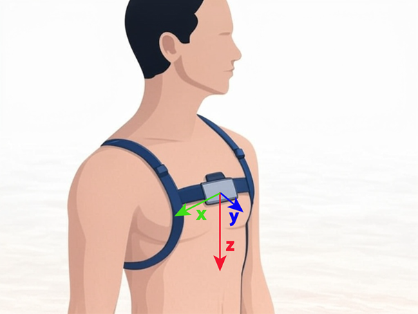

# Určení aktivity z akcelerometrických dat

Cílem je vytvořit program v souboru `acc_activity.py`, který bude určovat činnost snímaného člověka na základě dat z akcelerometru umístěného na hrudním pásu.

Akcelerometr určuje zrychlení dle pohybu ve třech osách (3D vektor – *x*, *y*, *z*), kde:



* osa *z* směřuje k nohám,
* osa *x* k pravé ruce,
* osa *y* ven z hrudníku.

Akcelerometr zároveň zaznamenává gravitační zrychlení (9.81 m/s²), takže stojícímu člověku zaznamená hodnoty v ideálním 
případě `(0, 0, 9.81)`. Pokud člověk leží na zádech `(0, -9.81, 0)`.

Tvým úkolem bude zpracovat krátké záznamy z několika časových okamžiků a na základě jednoduchých pravidel rozhodnout, 
zda se osoba pohybuje, stojí nebo leží.

Data (vstupní vektorový signál) budeme předpokládat ve formátu seznamu trojic čísel (viz ukázková data ve výchozím souboru `acc_activity.py`):

```python
[(0.11, -0.08, 9.80), (-0.14, 0.01, 9.81), ...]
```

---

## Úkol 1 – délka vektoru

Pro vyhodnocení se nám bude hodit spočítat délku 3D vektoru v každém časovém okamžiku.

Vytvoř nový signál (seznam čísel), kde hodnota bude vypočítaná jako $\sqrt{x^2 + y^2 + z^2}$.

Výsledkem bude nový stejně dlouhý seznam, kde místo trojice bude vždy jedna hodnota.

* Vytvoř funkci `get_magnitude_signal()`.

* Funkce bude mít jeden vstupní parametr:
    * vektorový signál – seznam trojic čísel (list of 3-tuples of floats).

* Funkce bude vracet jednu hodnotu:
  * signál délek vektoru – seznam čísel (list of floats).

---

## Úkol 2 – určení aktivity

Dále se už pustíme do rozpoznání aktivity s možnostmi `moving'`, `'lying'` a `'standing'`:

1.  Při pohybu (`moving`) se vektor prodlouží a to můžeme detekovat - rozpoznat, zda hodnota překročila práh.
2. Při ležení (`lying`) se gravitační složka přesune z osy *z* do *x* nebo *y* (podle toho zda osoba leží na boku nebo na zádech)
  a můžeme tedy zjišťovat, zda je absolutní hodnota v ose *z* největší. 
  > Pro absolutní hodnotu využij funkci `abs()`, která je dostupná bez importu.

Rozhodnutí pro každý časový okamžik bude vycházet z následujících pravidel:

1. pokud je délka vektoru větší než práh → `'moving'`,
2. jinak pokud `|x|` nebo `|y|` > `|z|` → `'lying'`,
3. jinak → `'standing'`.


* Vytvoř funkci `get_activity_signal()`.

* Funkce bude mít tři vstupní parametry:
  * vektorový signál – seznam trojic čísel (list of 3-tuples of floats),
  * signál délek vektoru (z Úkolu 1),
  * prahová hodnota pro pohyb (float, defaultně `9.91`)

* Funkce bude vracet jednu hodnotu:
  * signál reprezentující aktivity (list of strings), např.:

    ```python
    ['standing', 'standing', 'moving', 'lying']
    ```

---

## Úkol 3 – dominantní aktivita

Urči aktivitu, která se v signálu vyskytuje nejčastěji.

> Pokud je více aktivit se stejným počtem výskytů, vyber libovolnou.

* Vytvoř funkci `get_dominant_activity()`.

* Funkce bude mít jeden vstupní parametr:
  * signál aktivit (z Úkolu 2).

* Funkce bude vracet jednu hodnotu:
  * dominantní aktivita (str).

---

## Úkol 4 – načítání signálu ze souboru

Načti data ze souboru `acc_xyz_signal_0.csv` nebo `acc_xyz_signal_1.csv`, které jsou v adresáři `data`. 
Podle obsahu souboru vytvoř vhodné načítání do formátu potřebného v úkolu 1.

* Vytvoř funkci `read_acc_xyz_signal()`.

* Funkce bude mít jeden vstup:
  * název souboru (str).

* Funkce bude vracet jednu hodnotu:
  * vektorový signál (list of 3-tuples of floats).

---

## Úkol 5 – hlavní funkce

Vytvoř funkci, která:

1. načte data ze souboru,
2. zavolá postupně všechny předchozí funkce,
3. vypíše výsledky jednotlivých kroků.

* Vytvoř funkci `main()`.

* Funkce bude mít jeden vstupní parametr:
  * název souboru (str).

* Funkce nebude vracet žádnou hodnotu.

---


### Příkazy pro git
1. Přidat soubor:
   ```commandline
   git add acc_activity.py
   ```
2. Vytvořit commit:
   ```commandline
   git commit -m "Commit message"
   ```
3. Odeslat na GitHub:
   ```commandline
   git push origin main
   ```

### Příkazy pro pytest
* Instalace:
  ```commandline
  uv sync
  ```
* Spuštění všech testů:
  ```commandline
  uv run pytest -v
  ```
* Spuštění konkrétního souboru s testy:
  ```commandline
  uv run pytest tests/name_of_the_test_file.py
  ```
